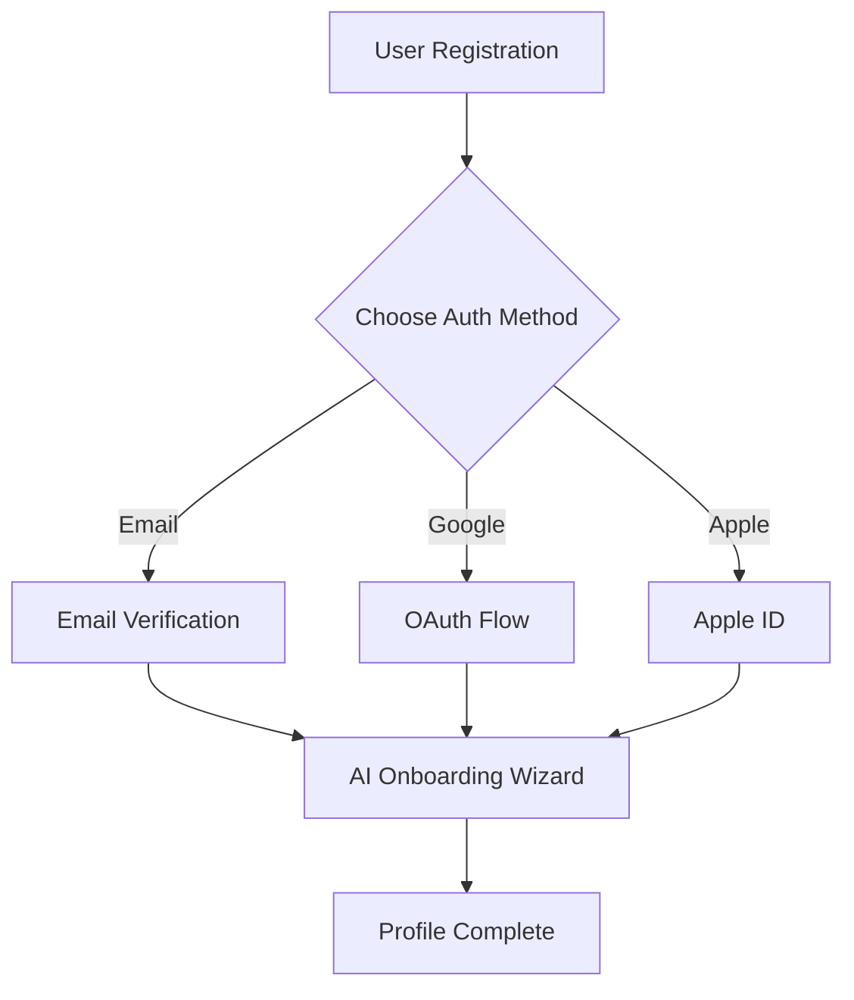

# Interactive Documentation Features

**Project**: FifaRun  
**Version**: 1.0  
**Last Updated**: 2025-08-21

## Overview

This document describes the interactive features designed to enhance the documentation experience when viewed in an interactive environment (website, GitHub Pages, or documentation platform).

---

## 🔍 Search Functionality

### Global Search System
**Implementation**: Full-text search across all documentation files with intelligent ranking.

```javascript
// Example search configuration
const searchConfig = {
  documents: [
    'README.md',
    '01-project-requirements.md',
    '02-app-flow.md',
    '03-tech-stack.md',
    '04-frontend-guidelines.md',
    '05-implementation-plan.md',
    'glossary.md'
  ],
  features: {
    fuzzySearch: true,
    highlighting: true,
    contextPreview: 3, // lines of context
    categorization: true
  }
};
```

**Search Categories**:
- 🏢 **Business Requirements** - Goals, features, user flows
- ⚙️ **Technical Specifications** - Architecture, APIs, tech stack
- 🎨 **Design & UI** - Frontend guidelines, component specs
- 📋 **Implementation** - Development phases, tasks, timelines
- 📖 **Reference** - Glossary, cross-references, links

### Search Interface Design
```markdown
┌─ Search FifaRun Documentation ──────────────────────┐
│ [🔍] crypto wallet                                  │
├─────────────────────────────────────────────────────┤
│ 📋 Project Requirements                             │
│ > Crypto wallet with USD-based platform currency...│
│                                                     │
│ ⚙️ Technical Architecture                           │
│ > Cpay.world non-custodial gateway for secure...   │
│                                                     │
│ 📱 User Flows                                       │
│ > Wallet Management - Balance and Transactions...   │
└─────────────────────────────────────────────────────┘
```

---

## 📂 Collapsible Sections

### Technical Specifications
<details>
<summary><strong>🔧 Database Schema Details</strong> <em>(Click to expand)</em></summary>

```sql
-- User Management Tables
CREATE TABLE users (
  id UUID PRIMARY KEY DEFAULT gen_random_uuid(),
  email TEXT UNIQUE NOT NULL,
  username TEXT UNIQUE NOT NULL,
  avatar_url TEXT,
  skill_rating INTEGER DEFAULT 1000,
  platforms TEXT[] DEFAULT '{}',
  created_at TIMESTAMP DEFAULT NOW(),
  updated_at TIMESTAMP DEFAULT NOW()
);

-- Challenge System Tables  
CREATE TABLE challenges (
  id UUID PRIMARY KEY DEFAULT gen_random_uuid(),
  creator_id UUID REFERENCES users(id) ON DELETE CASCADE,
  opponent_id UUID REFERENCES users(id) ON DELETE CASCADE,
  game_mode TEXT NOT NULL,
  platform TEXT NOT NULL,
  stake_amount DECIMAL(10,2) DEFAULT 0,
  status TEXT CHECK (status IN ('pending', 'active', 'completed', 'disputed', 'cancelled')),
  rules JSONB DEFAULT '{}',
  evidence JSONB DEFAULT '{}',
  result JSONB,
  created_at TIMESTAMP DEFAULT NOW(),
  expires_at TIMESTAMP
);

-- Financial Tables
CREATE TABLE transactions (
  id UUID PRIMARY KEY DEFAULT gen_random_uuid(),
  user_id UUID REFERENCES users(id) ON DELETE CASCADE,
  challenge_id UUID REFERENCES challenges(id) ON DELETE SET NULL,
  type TEXT CHECK (type IN ('deposit', 'withdrawal', 'escrow_lock', 'escrow_release', 'fee')),
  amount DECIMAL(10,2) NOT NULL,
  currency TEXT DEFAULT 'USDC',
  status TEXT CHECK (status IN ('pending', 'completed', 'failed', 'cancelled')),
  external_tx_id TEXT,
  created_at TIMESTAMP DEFAULT NOW()
);
```
</details>

### API Specifications
<details>
<summary><strong>🌐 Authentication API Endpoints</strong> <em>(Click to expand)</em></summary>

```typescript
// Authentication API Interface
interface AuthAPI {
  // User Registration
  POST /auth/register
  Body: {
    email: string;
    password: string;
    username: string;
    platforms: Platform[];
  }
  Response: {
    user: User;
    session: Session;
    onboarding_required: boolean;
  }

  // Multi-Provider Login
  POST /auth/login
  Body: {
    provider: 'email' | 'google' | 'apple' | 'phone';
    credentials: LoginCredentials;
  }
  Response: {
    user: User;
    session: Session;
    requires_2fa: boolean;
  }

  // Session Management
  GET /auth/session
  Headers: { Authorization: 'Bearer <token>' }
  Response: {
    user: User;
    expires_at: string;
    permissions: string[];
  }
}
```
</details>

### Implementation Phases
<details>
<summary><strong>🚀 Phase 1: Foundation (Months 1-2)</strong> <em>(Click to expand)</em></summary>

**Month 1: Project Setup**
- [x] Monorepo architecture with Nx/Turborepo
- [x] TypeScript configuration across all projects
- [x] ESLint, Prettier, Husky setup
- [x] GitHub Actions CI/CD pipeline
- [ ] Storybook for component documentation
- [ ] Testing infrastructure (Jest, RTL, Cypress)

**Month 2: Authentication System**
- [ ] Supabase auth integration
- [ ] Multi-provider login (email, Google, Apple, phone)
- [ ] User profile management
- [ ] AI onboarding wizard with GPT-4o
- [ ] Session management and security
- [ ] Basic UI components and layouts

**Success Criteria:**
- ✅ Secure user registration and login
- ✅ Functional onboarding wizard
- ✅ Basic profile management
- ✅ Development environment ready for next phase
</details>

---

## 🎯 Role-Based Filtering

### Filter Categories
Users can filter documentation to show relevant content based on their role:

#### 👨‍💻 Developer View
- Technical architecture details
- API specifications and code examples
- Database schemas and data models
- Development setup and guidelines
- Testing and deployment procedures

#### 🎨 Designer View  
- User flows and wireframes
- UI/UX specifications
- Design system and components
- Accessibility requirements
- Mobile and responsive design

#### 📊 Product Manager View
- Business requirements and goals
- Feature specifications and user stories
- Market analysis and competitive research
- Success metrics and KPIs
- Timeline and resource planning

#### 🔧 DevOps View
- Infrastructure and deployment
- Security and compliance requirements
- Performance and scalability specs
- Monitoring and logging setup
- CI/CD pipeline configuration

### Filter Implementation
```javascript
const roleFilters = {
  developer: {
    show: ['technical', 'api', 'code', 'database', 'testing'],
    hide: ['business-case', 'market-analysis', 'user-research']
  },
  designer: {
    show: ['ui-ux', 'user-flow', 'design-system', 'accessibility'],
    hide: ['database-schema', 'api-endpoints', 'deployment']
  },
  product: {
    show: ['requirements', 'features', 'user-stories', 'metrics'],
    hide: ['code-examples', 'technical-specs', 'dev-setup']
  },
  devops: {
    show: ['infrastructure', 'deployment', 'security', 'performance'],
    hide: ['user-flows', 'design-specs', 'business-requirements']
  }
};
```

---

## 🧭 Breadcrumb Navigation

### Navigation Structure
```
FifaRun Documentation
├── 📋 Project Requirements
│   ├── Project Overview
│   ├── Core Features
│   │   ├── Authentication & Profiles
│   │   ├── Crypto Wallet & Payments ← You are here
│   │   └── AI Matchmaking
│   └── Technical Stack
├── 📱 User Flows
└── ⚙️ Technical Architecture
```

### Interactive Breadcrumbs
```html
<!-- Example breadcrumb implementation -->
<nav aria-label="Breadcrumb">
  <ol class="breadcrumb">
    <li><a href="#home">🏠 FifaRun Docs</a></li>
    <li><a href="#requirements">📋 Requirements</a></li>
    <li><a href="#core-features">Core Features</a></li>
    <li class="active">Crypto Wallet & Payments</li>
  </ol>
</nav>
```

---

## ⚡ Quick Jump Menu

### Floating Navigation Widget
```markdown
╭─ Quick Jump ─╮
│ 📋 Requirements │
│ 📱 User Flows   │
│ ⚙️ Tech Stack   │ ← Current
│ 🎨 Frontend     │
│ 🗺️ Roadmap     │
│ 📖 Glossary    │
╰────────────────╯
```

### Section Jump Within Document
```markdown
┌─ Tech Stack Navigation ─────────┐
│ • Frontend Technologies         │
│ • Backend Technologies         │ ← You are here  
│ • Infrastructure & Deployment   │
│ • Third-Party Integrations     │
│ • Security & Performance       │
└─────────────────────────────────┘
```

---

## 📊 Progress Tracking

### Implementation Progress Indicators

#### Overall Project Progress
```
🚀 FifaRun Development Progress: 15% Complete

Phase 1: Foundation           ████████████████████ 100% ✅
Phase 2: Core Features        ████▓▓▓▓▓▓▓▓▓▓▓▓▓▓▓▓  25% 🔄
Phase 3: Social & Monetization ▓▓▓▓▓▓▓▓▓▓▓▓▓▓▓▓▓▓▓▓   0% ⏳
Phase 4: Advanced Features    ▓▓▓▓▓▓▓▓▓▓▓▓▓▓▓▓▓▓▓▓   0% ⏳
Phase 5: Launch Preparation   ▓▓▓▓▓▓▓▓▓▓▓▓▓▓▓▓▓▓▓▓   0% ⏳
```

#### Feature-Specific Progress  
```
💰 Crypto Wallet Implementation: 60% Complete

✅ Cpay.world Integration     ████████████████████ 100%
🔄 Multi-Currency Support     ████████████▓▓▓▓▓▓▓▓  60%
⏳ Escrow Smart Contracts     ████▓▓▓▓▓▓▓▓▓▓▓▓▓▓▓▓  20%
⏳ Transaction History UI     ▓▓▓▓▓▓▓▓▓▓▓▓▓▓▓▓▓▓▓▓   0%
```

### Interactive Progress Dashboard
```javascript
// Progress tracking implementation
const progressTracker = {
  phases: {
    foundation: { completed: 12, total: 12, status: 'completed' },
    coreFeatures: { completed: 8, total: 32, status: 'in-progress' },
    socialMonetization: { completed: 0, total: 24, status: 'pending' },
    advancedFeatures: { completed: 0, total: 16, status: 'pending' },
    launchPrep: { completed: 0, total: 20, status: 'pending' }
  },
  
  calculateOverallProgress() {
    const total = Object.values(this.phases).reduce((sum, phase) => sum + phase.total, 0);
    const completed = Object.values(this.phases).reduce((sum, phase) => sum + phase.completed, 0);
    return Math.round((completed / total) * 100);
  }
};
```

---

## 🎨 Visual Enhancements

### Syntax Highlighting
Code blocks with language-specific highlighting and copy buttons:

```typescript
// TypeScript example with syntax highlighting
interface ChallengeRequest {
  gameMode: 'ultimate-team' | 'career' | 'seasons';
  platform: 'playstation' | 'xbox' | 'pc';
  stakeAmount: number;
  expirationTime?: Date;
}
```

### Interactive Diagrams


### Status Badges
- 🟢 **Completed** - Implementation finished and tested
- 🟡 **In Progress** - Currently under development  
- 🔴 **Blocked** - Waiting on dependencies or decisions
- ⚪ **Planned** - Scheduled for future development
- 🟣 **Research** - Investigation and design phase

---

## 📱 Mobile-Responsive Features

### Collapsible Mobile Menu
```
☰ Documentation Menu
├─ 📋 Requirements
├─ 📱 User Flows
├─ ⚙️ Tech Stack ✓
├─ 🎨 Frontend
├─ 🗺️ Roadmap
└─ 📖 Glossary
```

### Touch-Friendly Navigation
- Large tap targets for mobile devices
- Swipe gestures for document navigation
- Collapsible sections optimized for small screens
- Sticky headers for context retention

---

## 🔧 Implementation Guide

### For Static Site Generators
```yaml
# _config.yml for Jekyll/GitHub Pages
plugins:
  - jekyll-toc
  - jekyll-sitemap
  - jekyll-feed

markdown: kramdown
kramdown:
  input: GFM
  syntax_highlighter: rouge
  toc_levels: 1..6

search:
  enabled: true
  provider: lunr
```

### For Documentation Platforms
```javascript
// Docusaurus configuration
module.exports = {
  title: 'FifaRun Documentation',
  tagline: 'Comprehensive platform documentation',
  
  themeConfig: {
    navbar: {
      title: 'FifaRun',
      items: [
        { to: '/', label: 'Home' },
        { to: '/requirements/', label: 'Requirements' },
        { to: '/flows/', label: 'User Flows' },
        { to: '/tech/', label: 'Tech Stack' }
      ]
    },
    
    algolia: {
      appId: 'YOUR_APP_ID',
      apiKey: 'YOUR_SEARCH_API_KEY',
      indexName: 'fifarun-docs'
    }
  },
  
  plugins: [
    ['@docusaurus/plugin-content-docs', {
      sidebarCollapsible: true,
      sidebarCollapsed: false
    }]
  ]
};
```

---

## 📈 Analytics and Insights

### Documentation Usage Metrics
- **Page Views** - Most accessed documentation sections
- **Search Queries** - Popular search terms and missing content
- **Navigation Paths** - How users move through documentation
- **Time on Page** - Content engagement and complexity indicators
- **Mobile vs Desktop** - Device usage patterns

### User Feedback Integration
```markdown
Was this page helpful? 👍 👎

📝 **Feedback Form**
- [ ] Information was clear and accurate
- [ ] Examples were helpful
- [ ] Navigation was intuitive
- [ ] Found what I was looking for

💬 **Suggestions for improvement:**
[Feedback text area]
```

---

**Implementation Status**: 🟡 **Framework Defined** - Ready for interactive platform implementation

**Next Steps**: 
1. Choose documentation platform (GitHub Pages, Docusaurus, GitBook)
2. Implement search functionality
3. Add interactive elements and progress tracking
4. Test mobile responsiveness and accessibility

---

**Navigation**: [← Documentation Home](./README.md) | [Cross-References](./cross-reference-index.md) | [Link Validator](./link-validator.md)