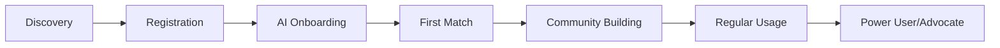

# Product Manager View - FifaRun Documentation

**Target Audience**: Product Managers, Business Analysts, Stakeholders  
**Focus**: Business requirements, user flows, metrics, roadmap planning  
**Last Updated**: 2025-08-21

---

## 🎯 Executive Summary

### FifaRun Platform Overview
FifaRun is a **global gaming platform** connecting FIFA players across PlayStation, Xbox, and PC for competitive matches with real money stakes or friendly gameplay. The platform addresses key market gaps in fair opponent matching, secure financial transactions, and community building for gaming enthusiasts.

### Business Objectives
- **Primary Goal**: Create the leading platform for competitive FIFA gaming with secure crypto payments
- **User Acquisition Target**: 100,000+ registered users within first year  
- **Revenue Target**: $2M ARR through subscriptions, transaction fees, and affiliate programs
- **Market Position**: Premium alternative to informal gaming communities with professional-grade features

---

## 📊 Market Opportunity

### Total Addressable Market (TAM)
- **FIFA Player Base**: 32+ million active players globally
- **Esports Betting Market**: $14B projected by 2025
- **Gaming Platform Revenue**: $180B industry with 15% annual growth
- **Crypto Gaming Adoption**: 45% growth year-over-year

### Target User Segments
1. **Competitive Gamers (Primary)** - 18-35, skilled FIFA players seeking fair competition
2. **Casual Bettors (Secondary)** - 25-45, recreational players interested in low-stakes gaming
3. **Gaming Communities (Tertiary)** - Gaming cafes, esports organizations, student groups

### Competitive Advantage
- **AI-Powered Matchmaking** - GPT-4o ensures fair, skill-based opponent pairing
- **Crypto Payment Integration** - Secure, fast transactions with global accessibility
- **Cross-Platform Support** - Unified experience across all major gaming platforms
- **Community Features** - Social elements drive engagement and retention

---

## 🎮 Core Features & User Value

### Essential Platform Features
| Feature | User Value | Business Impact |
|---------|------------|-----------------|
| **AI Matchmaking** | Fair opponents, better gaming experience | Higher user satisfaction, retention |
| **Crypto Wallet** | Secure payments, global accessibility | Transaction revenue, reduced fraud |
| **Real-Time Chat** | Social connection, community building | Increased engagement, viral growth |
| **Dispute Resolution** | Trust and fairness in competition | Reduced support costs, user confidence |
| **Leaderboards** | Recognition and competition | Gamification drives continued usage |

### User Journey Mapping


**Key Conversion Points:**
- **Registration → Onboarding**: 85% target conversion
- **Onboarding → First Match**: 70% target conversion  
- **First Match → Second Match**: 60% target conversion
- **Monthly Active → Paying User**: 25% target conversion

---

## 💰 Business Model & Revenue Streams

### Freemium Subscription Tiers
| Plan | Price | Features | Target Segment |
|------|-------|----------|----------------|
| **Free** | $0/month | Basic matching, 3 matches/month | New users, casual players |
| **Pro** | $4.99/month | Unlimited matches, advanced features | Regular players |
| **Elite** | $14.99/month | Priority support, exclusive features | Power users, competitive players |

### Revenue Projections (Year 1)
```
Subscription Revenue:    $800K   (40%)
Transaction Fees:        $600K   (30%)  
Affiliate Commissions:   $400K   (20%)
Pay-per-Match:          $200K   (10%)
Total Projected ARR:    $2.0M   (100%)
```

### Unit Economics
- **Customer Acquisition Cost (CAC)**: $15 target
- **Lifetime Value (LTV)**: $120 projected
- **LTV/CAC Ratio**: 8:1 (healthy SaaS benchmark)
- **Gross Margin**: 75% (high margin due to platform model)

---

## 👥 User Personas & User Stories

### Primary Persona: "Competitive Carlos"
**Demographics**: 24 years old, college graduate, disposable income $500+/month  
**Gaming Profile**: FIFA Ultimate Team player, 2-3 hours daily, skill rating 1800+  
**Motivations**: Fair competition, earning potential, skill recognition  
**Pain Points**: Cheaters, unfair matches, payment security concerns

**User Stories:**
- "As a competitive player, I want AI-matched opponents so I have fair, challenging games"
- "As a frequent player, I want secure crypto payments so I don't worry about chargebacks"  
- "As a skilled gamer, I want leaderboards so I can showcase my abilities to friends"

### Secondary Persona: "Social Sarah"  
**Demographics**: 28 years old, working professional, moderate gaming budget  
**Gaming Profile**: Casual FIFA player, prefers friendly matches, social gaming  
**Motivations**: Fun competition, connecting with friends, stress relief  
**Pain Points**: Intimidating competition, complex interfaces, high stakes pressure

**User Stories:**
- "As a casual player, I want friendly matches so I can enjoy games without financial risk"
- "As a social gamer, I want group features so I can organize tournaments with friends"
- "As a busy professional, I want quick matchmaking so I can find games during breaks"

---

## 📈 Success Metrics & KPIs

### Growth Metrics
- **Monthly Active Users (MAU)**: Track platform engagement
- **Daily Active Users (DAU)**: Measure sticky usage patterns
- **User Acquisition Rate**: Monitor growth velocity
- **Viral Coefficient**: Track referral program effectiveness

### Engagement Metrics  
- **Matches per User per Month**: Core usage indicator
- **Session Duration**: Platform stickiness measure
- **Retention Rates**: Day 1, 7, 30, 90 retention tracking
- **Feature Adoption**: Usage of advanced features by user segment

### Financial Metrics
- **Monthly Recurring Revenue (MRR)**: Subscription growth
- **Transaction Volume**: Platform transaction throughput
- **Average Revenue Per User (ARPU)**: Revenue efficiency
- **Churn Rate**: User retention performance

### Quality Metrics
- **Match Completion Rate**: Platform reliability
- **Dispute Resolution Time**: Customer satisfaction
- **User Satisfaction Score (NPS)**: Overall platform sentiment  
- **Platform Uptime**: Technical performance

---

## 🗺️ Product Roadmap

### Phase 1: Foundation (Months 1-2) ✅
**Status**: Completed  
**Key Deliverables:**
- ✅ Multi-provider authentication system
- ✅ Basic user profiles and onboarding
- ✅ Core platform infrastructure
- ✅ Initial UI/UX implementation

**Success Criteria:**
- ✅ Secure user registration and login  
- ✅ Functional onboarding experience
- ✅ Stable development environment

### Phase 2: Core Gaming (Months 3-5) 🔄
**Status**: 60% Complete  
**Key Deliverables:**
- 🔄 Challenge creation and joining system
- 🔄 AI-powered matchmaking with GPT-4o
- 🔄 Crypto wallet integration (Cpay.world)
- ⏳ Match result verification system
- ⏳ Basic dispute resolution

**Success Criteria:**
- [ ] Users can create and join challenges
- [ ] AI suggests appropriate opponents
- [ ] Secure crypto transactions working
- [ ] Match results accurately recorded

### Phase 3: Social & Monetization (Months 6-8) ⏳
**Key Deliverables:**
- [ ] Friends and groups functionality
- [ ] Real-time chat system (Firebase)
- [ ] Subscription plan implementation
- [ ] Affiliate program launch
- [ ] Leaderboards and achievements

**Success Criteria:**
- [ ] Active social features driving engagement
- [ ] Subscription conversions meeting targets
- [ ] Affiliate program generating referrals

### Phase 4: Advanced Features (Months 9-10) ⏳
**Key Deliverables:**
- [ ] Enhanced AI fraud detection
- [ ] Advanced dispute resolution
- [ ] Agent dashboard for gaming studios
- [ ] Admin and moderator tools
- [ ] Performance optimization

### Phase 5: Launch Preparation (Months 11-12) ⏳
**Key Deliverables:**
- [ ] KYC compliance integration
- [ ] Comprehensive testing and QA
- [ ] Marketing and go-to-market strategy
- [ ] Public beta and launch

---

## ⚖️ Risk Analysis & Mitigation

### Technical Risks
| Risk | Impact | Probability | Mitigation Strategy |
|------|--------|-------------|-------------------|
| **Console API Limitations** | Medium | High | Manual verification fallback system |
| **Scalability Issues** | High | Medium | Cloud infrastructure, load testing |
| **Security Vulnerabilities** | High | Low | Regular audits, penetration testing |

### Business Risks
| Risk | Impact | Probability | Mitigation Strategy |
|------|--------|-------------|-------------------|
| **Regulatory Changes** | High | Medium | Legal compliance monitoring, KYC system |
| **Competition** | Medium | High | Unique AI features, strong community |
| **User Adoption** | High | Medium | Freemium model, strong onboarding |

### Financial Risks
| Risk | Impact | Probability | Mitigation Strategy |
|------|--------|-------------|-------------------|
| **High Customer Acquisition Costs** | Medium | Medium | Viral referral program, organic growth |
| **Crypto Market Volatility** | Medium | High | USD-based display, stablecoin integration |
| **Payment Processing Issues** | High | Low | Multiple payment providers, fallbacks |

---

## 🎯 Go-to-Market Strategy

### Launch Strategy
1. **Private Beta** (Month 10) - Invite 1,000 qualified FIFA players
2. **Public Beta** (Month 11) - Open registration with waitlist
3. **Full Launch** (Month 12) - Marketing campaign, press coverage

### Marketing Channels
- **Gaming Communities** - Reddit, Discord, Twitch partnerships
- **Influencer Marketing** - FIFA content creators, esports personalities
- **Social Media** - TikTok, Twitter, Instagram gaming content
- **Search Marketing** - SEO, Google Ads for FIFA-related keywords

### Partnership Opportunities
- **Gaming Cafes** - Agent program for bulk user onboarding
- **Esports Organizations** - Tournament hosting and sponsorships  
- **Content Creators** - Affiliate partnerships and sponsored content
- **Educational Institutions** - Student gaming leagues and competitions

---

## 📋 Feature Prioritization Framework

### MoSCoW Method Applied
**Must Have (Launch Blockers)**
- ✅ User authentication and profiles
- 🔄 Challenge creation and joining
- 🔄 Crypto wallet and payments
- ⏳ Basic matchmaking system
- ⏳ Match result submission

**Should Have (Launch Enhancers)**  
- ⏳ AI-powered matchmaking
- ⏳ Real-time chat
- ⏳ Friends and social features
- ⏳ Basic dispute resolution
- ⏳ Subscription system

**Could Have (Post-Launch)**
- [ ] Advanced analytics  
- [ ] Tournament organization
- [ ] Mobile app optimization
- [ ] Multiple game support
- [ ] Advanced AI features

**Won't Have (Out of Scope)**
- [ ] VR/AR integration
- [ ] Offline functionality
- [ ] Third-party tournament APIs
- [ ] Advanced machine learning models

---

## 🔗 Related Business Documentation

- **[Business Requirements](../01-project-requirements.md)** - Complete feature specifications and business logic
- **[User Experience Design](../02-app-flow.md)** - User flows and interaction patterns
- **[Technical Feasibility](../03-tech-stack.md)** - Technology choices and implementation approach
- **[Development Timeline](../05-implementation-plan.md)** - Detailed project phases and milestones
- **[Cross-Reference Index](../cross-reference-index.md)** - Business to technical concept mapping

---

**Business Tools**: [Google Analytics Dashboard](#) | [Mixpanel Events](#) | [Revenue Tracking](#) | [User Research Repository](#)